# Electra Frontend
Фронтенд для сервиса управления заказами электриков. React SPA с тремя зонами: лендинг для клиентов, личный кабинет исполнителя, админка владельца.

## Запуск
```bash
npm install
npm start
```

Откроется на [http://localhost:3000](http://localhost:3000/). 
Бэкенд должен быть запущен на [http://localhost:8080](http://localhost:8080/).

## Скриншоты
### Лендинг для клиентов
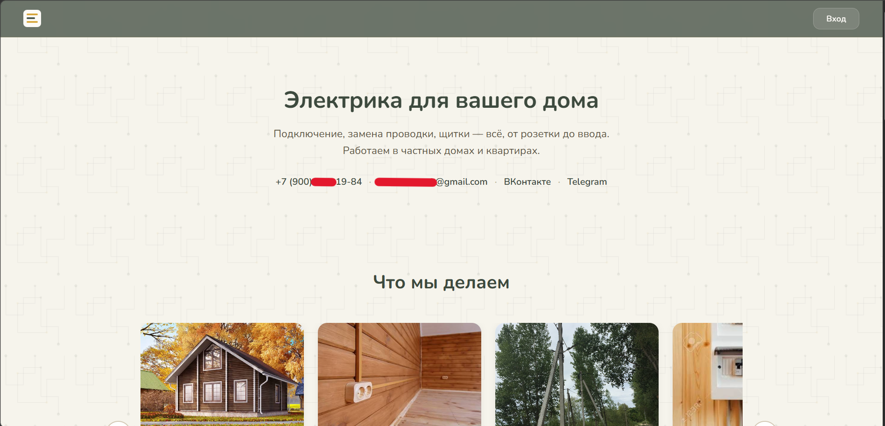
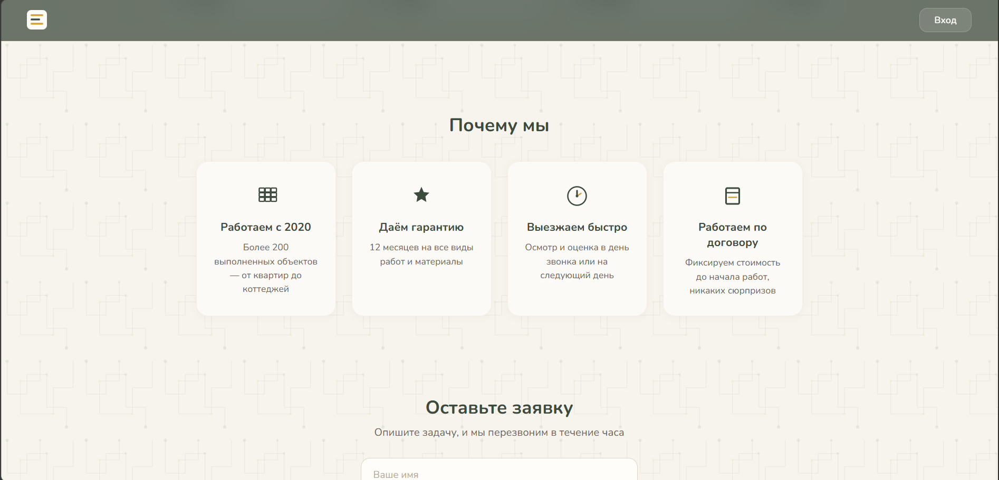
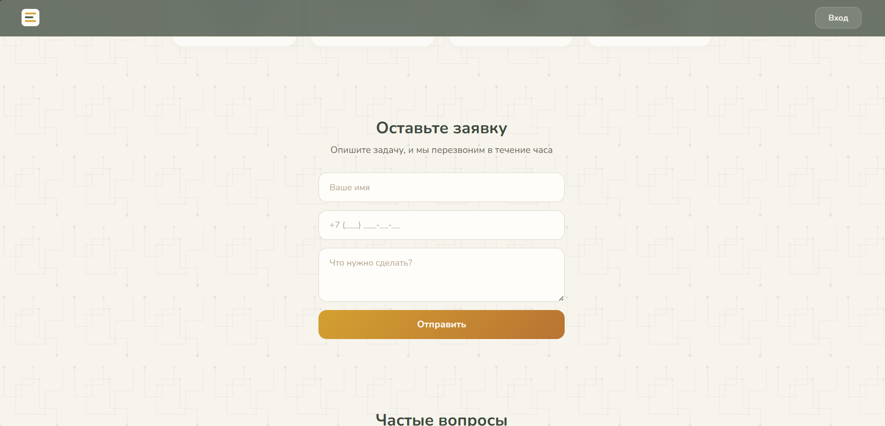
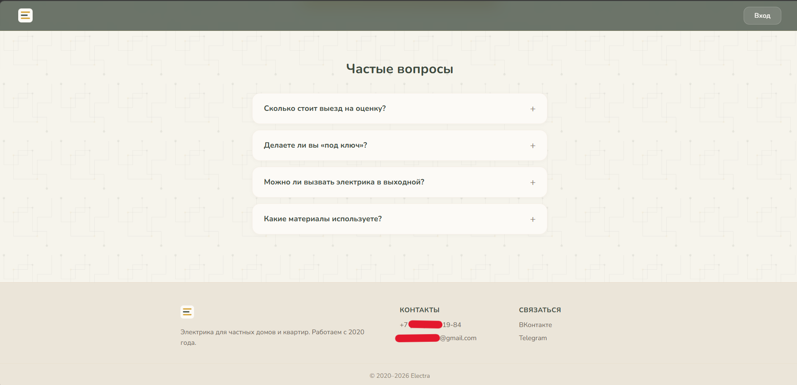
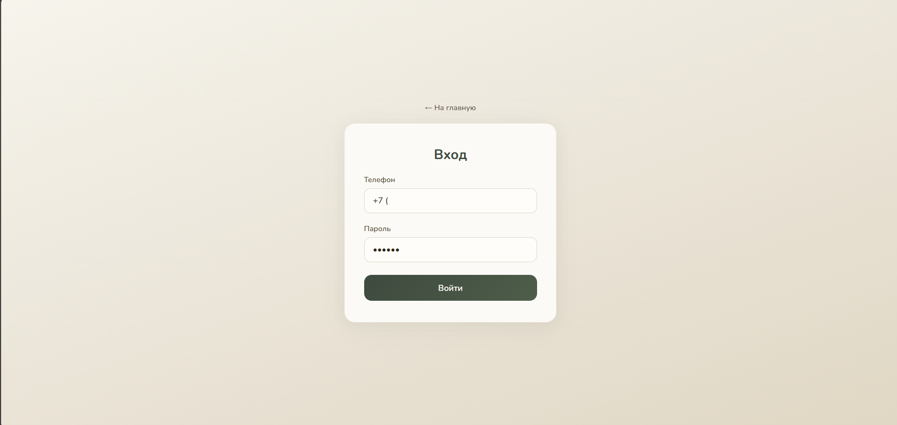

### Личный кабинет исполнителя
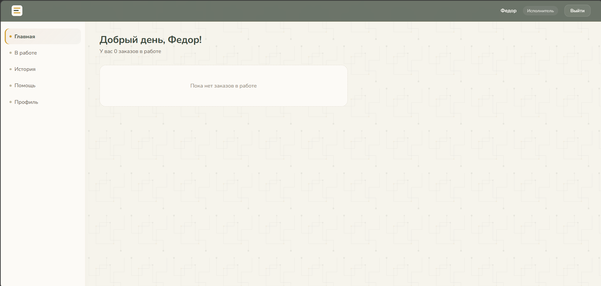
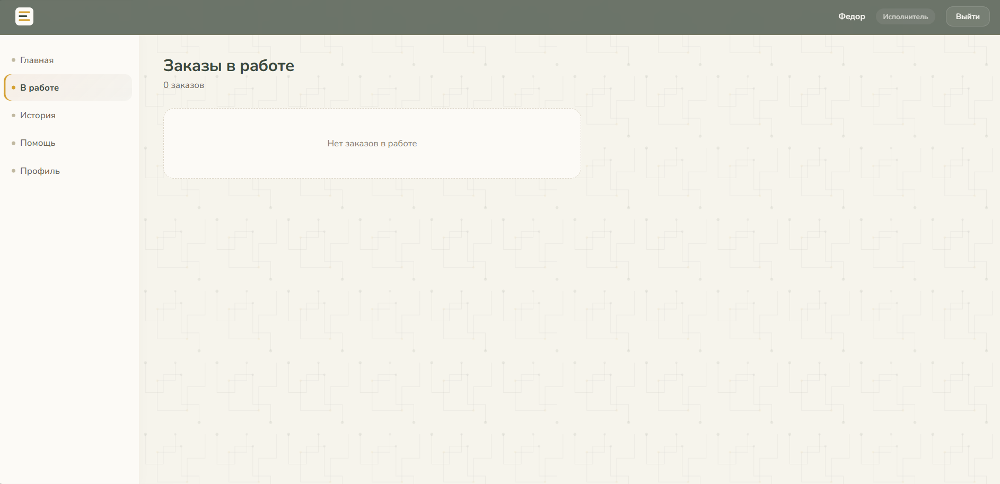
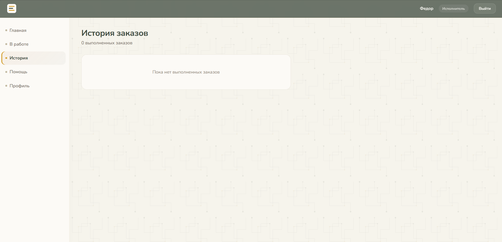
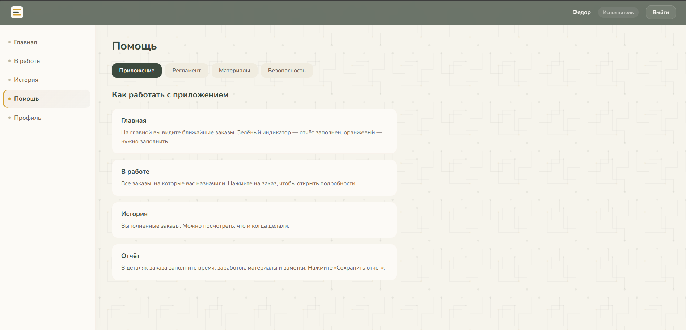
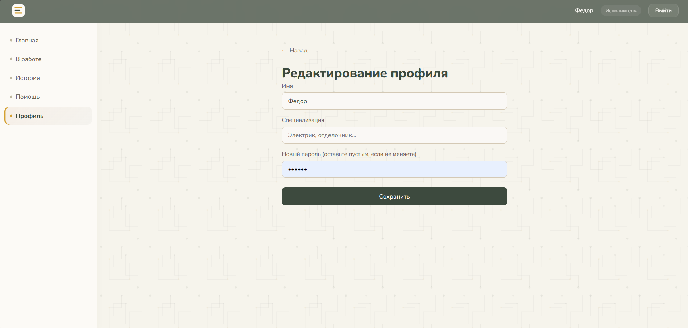

### Личный кабинет владельца
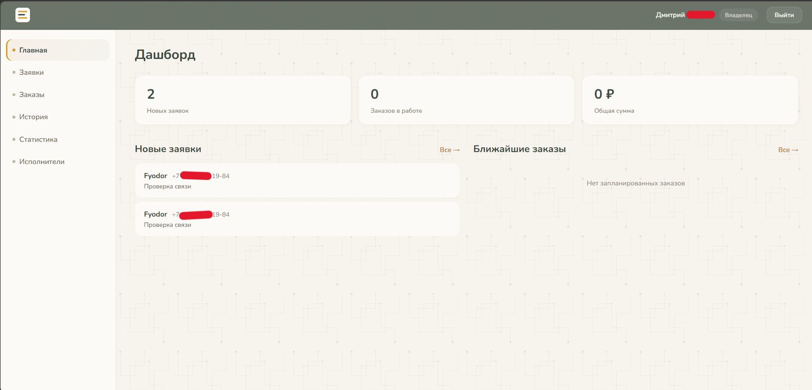
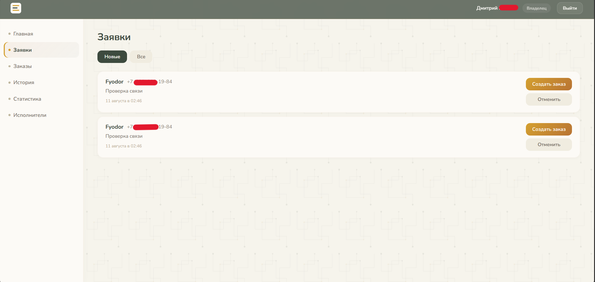
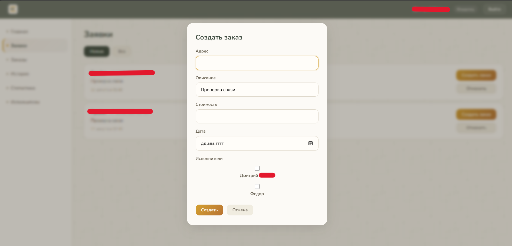
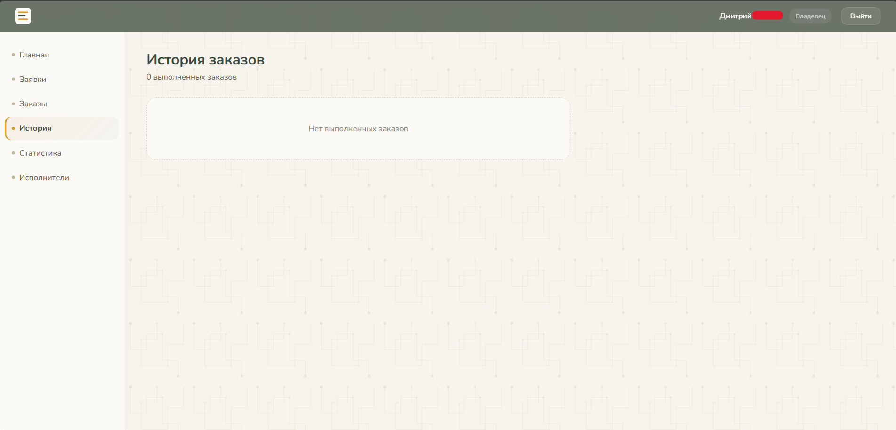
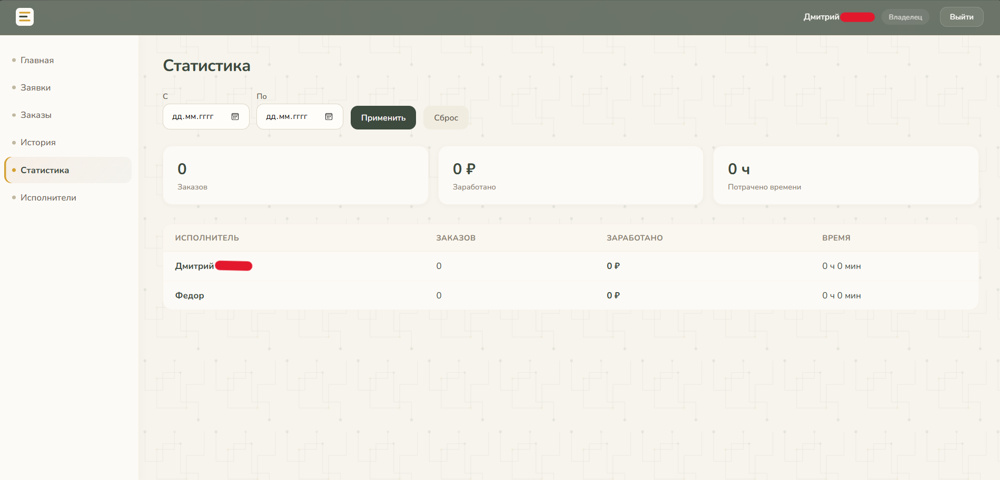
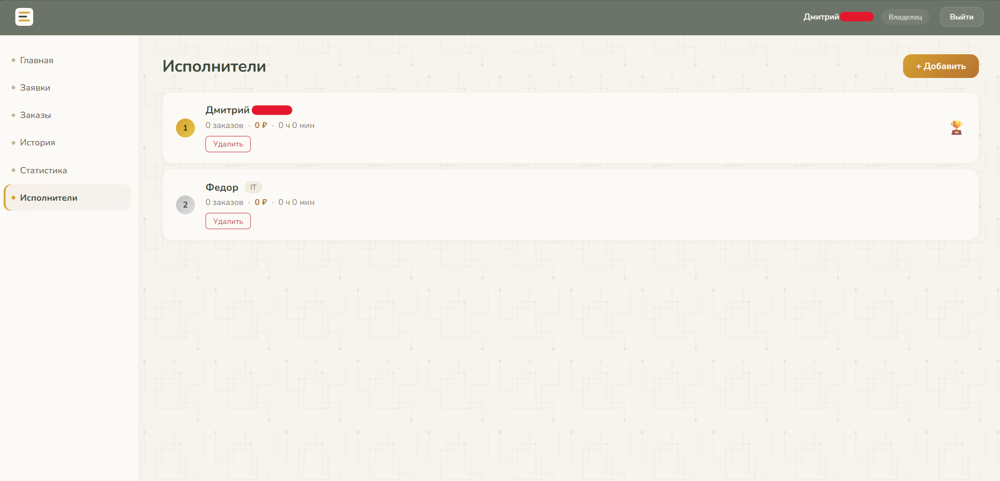

## Стек
* React 19
* React Router 7
* CSS Modules
